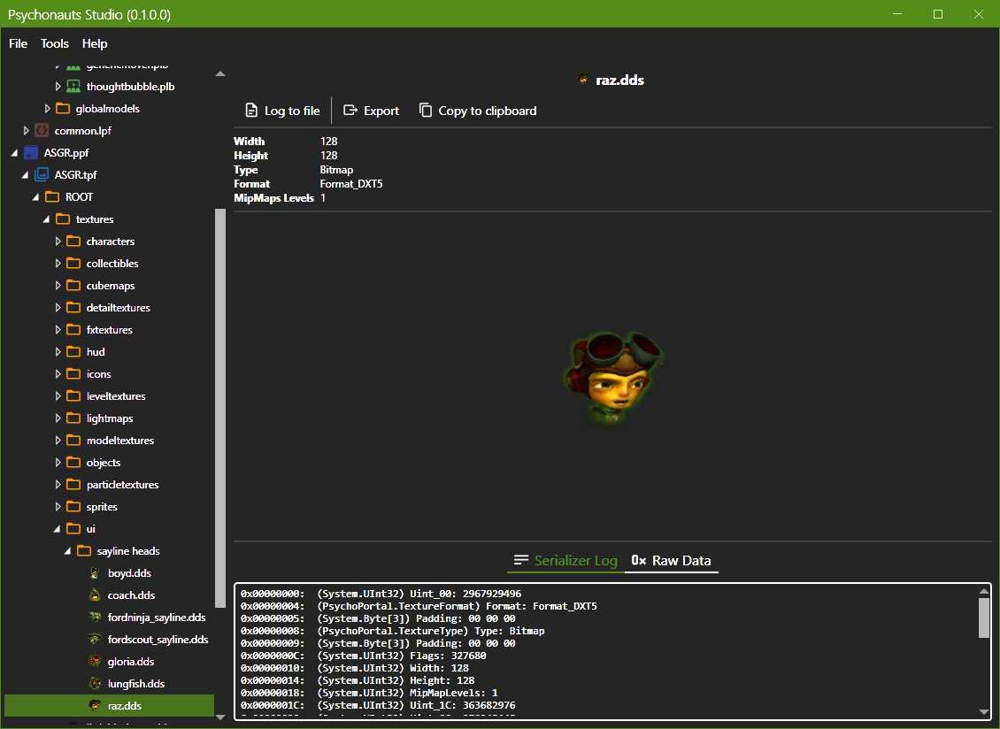

# Psychonauts Studio
Psychonauts Studio is a work in process tool for working with the different file formats in the original Psychonauts game. It supports all versions, including the PS2 version and early Xbox prototypes.

## Features
* Open and view the contents from supported file formats
* View the serialization log and raw data for supported binary data types

## Upcoming Features
* Modify data from the loaded files, such as replacing textures or level entities
* Batch-tools, such as exporting all textures from a package
* Support all texture types
* Convert file formats between versions